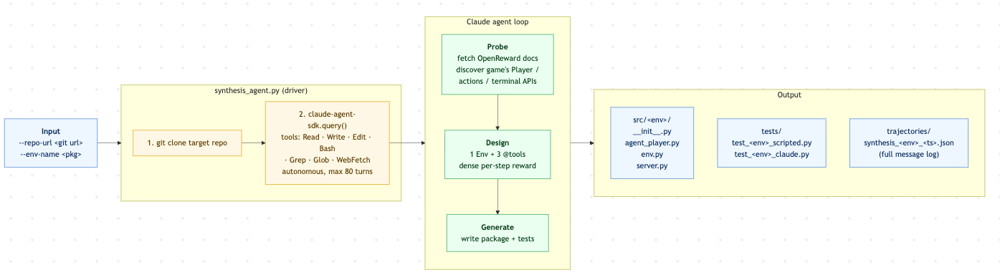

# rl-env-hackathon-complex-worlds

OpenReward agentic environments for complex games.

## Overview

This project provides OpenReward-based environments that enable LLM agents to play games including Settlers of Catan, Overcooked, and Diplomacy. Each environment exposes game state and actions through a tool-based interface, allowing agents to reason about and interact with the game world.

The project includes a trajectory analysis system that learns from past games to build experience libraries, which can be injected as system prompt extensions to improve agent performance.

## Synthesis Pipeline



## Features

- **Three Game Environments**: Catan, Overcooked, and Diplomacy, each with configurable difficulty levels
- **OpenReward Integration**: Tool-based environment interface designed for LLM agents
- **Claude Agent SDK Support**: Uses your Claude subscription for authentication (no ANTHROPIC_API_KEY required)
- **Experience Library System**: Analyze past trajectories and extract learned strategies
- **Visualization Support**: Catan includes live web visualization of game state
- **Testing Suite**: Scripted smoke tests and end-to-end Claude agent tests for each environment

## Installation

Requires Python 3.10+.

```bash
git clone https://github.com/yourusername/rl-env-hackathon-complex-worlds.git
cd rl-env-hackathon-complex-worlds
pip install -e .
```

## Project Structure

```
src/
  catan_env/       # Settlers of Catan environment
  overcooked_env/  # Overcooked AI environment
  diplomacy_env/   # Diplomacy environment

scripts/           # Sweep, analysis, and visualization scripts
tests/             # End-to-end and scripted tests
trajectories/      # Saved game trajectories (JSON)
experiences/       # Learned experience libraries (Markdown)
```

## Environments

### Catan (`src/catan_env/`)

Settlers of Catan environment powered by [Catanatron](https://github.com/bcollazo/catanatron).

**Difficulty Levels:**
- `very_easy`: 1 RandomPlayer, 5 VPs to win, friendly robber
- `easy`: 3 RandomPlayers, 8 VPs to win, friendly robber
- `medium`: 3 WeightedRandomPlayers, 10 VPs to win, hostile robber
- `hard`: 3 ValueFunctionPlayers, 10 VPs to win, hostile robber
- `very_hard`: 3 AlphaBetaPlayers, 10 VPs to win, hostile robber

**Available Tools:**
- `get_state()` - Return a textual summary of the current board state
- `list_legal_actions()` - Return numbered list of legal actions for the current decision
- `play_action(index: int)` - Apply a legal action by index and advance the game

### Overcooked (`src/overcooked_env/`)

Overcooked AI environment for cooperative cooking challenges.

### Diplomacy (`src/diplomacy_env/`)

Diplomacy environment for strategic negotiation and conquest.
